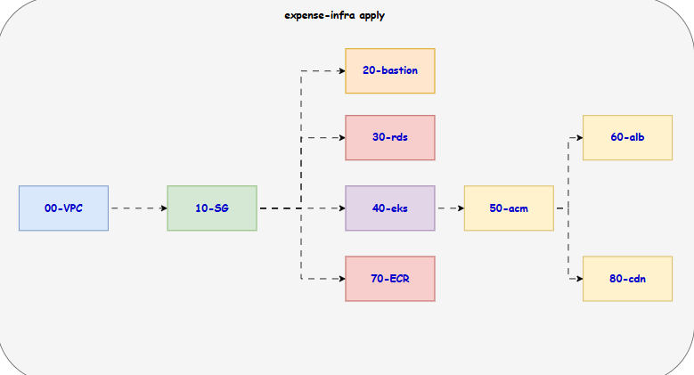

# Expense DEV Infrastructure



* Make sure infra is created. 
* Every resource should have dev in its name, so that it will not overlap with prod resources.

Once infra is setup. We need to configure ingress controller to provide internet access to our expense application.

We are using bastion as our EKS client, so it will have
* K9S
* kubectl
* helm
* aws configure

## RDS Configuration
* Since we are using RDS instead of MySQL image, we need to configure RDS manually, we are creating schema as part of RDS but table and user should be created.
* Make sure MySQL instance allows port no 3306 from bastion

```
mysql -h expense-dev.cn6mc26ic8xb.us-east-1.rds.amazonaws.com -u root -pExpenseApp1
```
```
USE transactions;
```
```
CREATE TABLE IF NOT EXISTS transactions (
    id INT AUTO_INCREMENT PRIMARY KEY,
    amount INT,
    description VARCHAR(255)
);
```
```
CREATE USER IF NOT EXISTS 'expense'@'%' IDENTIFIED BY 'ExpenseApp@1';
```
```
GRANT ALL ON transactions.* TO 'expense'@'%';
```
```
FLUSH PRIVILEGES;
```

## Target group binding
* If we are running frontend using normal user it can't bind the port 80. non root privelege user running container are not able to open system ports which are under 1024.
* So we have to use port no 8080 for frontend. Make sure
    * nginx.conf opens port no 8080 instead of 80.
    * ALB target group health check port should be 8080.
    * frontend service target port should be 8080 instead of 80.

## Ingress Controller

* Login to bastion host and get the kubeconfig of EKS cluster
```
aws configure
```

```
aws eks update-kubeconfig --region us-east-1 --name expense-dev
```

```
kubectl get nodes
```

* Create namespace expense
```
kubectl create namespace expense
```

* IAM policy

```
curl -o iam-policy.json https://raw.githubusercontent.com/kubernetes-sigs/aws-load-balancer-controller/v2.10.0/docs/install/iam_policy.json
```

* IAM Role created
```
aws iam create-policy \
    --policy-name AWSLoadBalancerControllerIAMPolicy \
    --policy-document file://iam-policy.json
```
* Create Service account. Replace your account ID.
```
eksctl create iamserviceaccount \
--cluster=expense-dev \
--namespace=kube-system \
--name=aws-load-balancer-controller \
--attach-policy-arn=arn:aws:iam::315069654700:policy/AWSLoadBalancerControllerIAMPolicy \
--override-existing-serviceaccounts \
--region us-east-1 \
--approve
```

* Install aws load balancer controller drivers through helm.

```
helm repo add eks https://aws.github.io/eks-charts
```

```
helm install aws-load-balancer-controller eks/aws-load-balancer-controller -n kube-system --set clusterName=expense-dev --set serviceAccount.create=false --set serviceAccount.name=aws-load-balancer-controller
```

* Make sure load balancer pods are running

```
kubectl get pods -n kube-system
NAME                                            READY   STATUS    RESTARTS   AGE
aws-load-balancer-controller-5fd7794f55-2f9sb   1/1     Running   0          48s
aws-load-balancer-controller-5fd7794f55-f27pq   1/1     Running   0          48s
aws-node-4z8l6                                  2/2     Running   0          66m
aws-node-cxtqt                                  2/2     Running   0          66m
coredns-789f8477df-gn8rh                        1/1     Running   0          71m
coredns-789f8477df-jmsth                        1/1     Running   0          71m
eks-pod-identity-agent-nxpk4                    1/1     Running   0          66m
eks-pod-identity-agent-r69ms                    1/1     Running   0          66m
kube-proxy-hmmtk                                1/1     Running   0          67m
kube-proxy-mdsjs                                1/1     Running   0          67m

```
